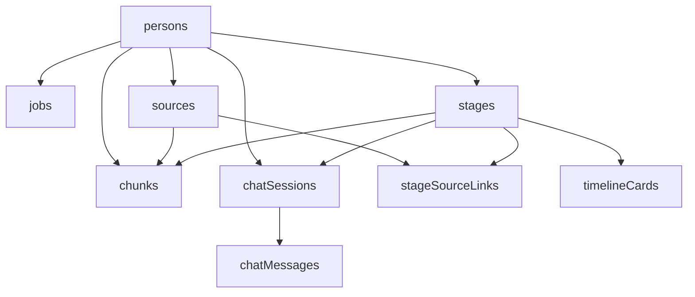

## Overview

LORE Timeline uses Convex's type-safe database with 9 core tables that store persons, sources, stages, chunks, timeline cards, and chat sessions. The schema is defined in `convex/schema.ts`.

## Schema Definition

```typescript
import { defineSchema, defineTable } from "convex/server";
import { v } from "convex/values";

export default defineSchema({
  persons: defineTable({ /* ... */ }),
  jobs: defineTable({ /* ... */ }),
  sources: defineTable({ /* ... */ }),
  stages: defineTable({ /* ... */ }),
  chunks: defineTable({ /* ... */ }),
  stageSourceLinks: defineTable({ /* ... */ }),
  timelineCards: defineTable({ /* ... */ }),
  chatSessions: defineTable({ /* ... */ }),
  chatMessages: defineTable({ /* ... */ }),
});
```

## Tables

### persons

The root entity representing a person whose biography is being processed.

<ResponseField name="_id" type="Id<'persons'>" required>
  Auto-generated unique identifier
</ResponseField>

<ResponseField name="name" type="string" required>
  Full name of the person (e.g., "Steve Jobs")
</ResponseField>

<ResponseField name="slug" type="string" required>
  URL-safe identifier (e.g., "steve-jobs-1708123456")
</ResponseField>

<ResponseField name="status" type="union" required>
  Current pipeline status:
  - `"pending"` - Just created, not started
  - `"processing"` - Pipeline running
  - `"ready"` - Pipeline complete, timeline available
  - `"failed"` - Pipeline encountered an error
</ResponseField>

<ResponseField name="birthDate" type="string" optional>
  Birth date in ISO format (e.g., "1955-02-24")
</ResponseField>

<ResponseField name="createdAt" type="number" required>
  Unix timestamp (milliseconds) when record was created
</ResponseField>

<ResponseField name="updatedAt" type="number" required>
  Unix timestamp (milliseconds) of last update
</ResponseField>

**Indexes:**
- `by_slug` - Fast lookup by slug for routing
- `by_created` - Chronological listing of persons

**Example:**

```typescript
{
  _id: "jd7x3k2m9n8p5q1r",
  name: "Steve Jobs",
  slug: "steve-jobs-1708123456",
  status: "ready",
  birthDate: "1955-02-24",
  createdAt: 1708123456789,
  updatedAt: 1708124567890
}
```

---

### jobs

Tracks progress of each pipeline phase for a person.

<ResponseField name="_id" type="Id<'jobs'>" required>
  Auto-generated unique identifier
</ResponseField>

<ResponseField name="personId" type="Id<'persons'>" required>
  Reference to the person being processed
</ResponseField>

<ResponseField name="phase" type="union" required>
  Pipeline phase:
  - `"discover"` - Source discovery via search
  - `"extract"` - Content extraction from URLs
  - `"stage"` - Life stage identification
  - `"embed"` - Vector embedding generation
  - `"publish"` - Timeline card creation
</ResponseField>

<ResponseField name="status" type="union" required>
  Job status:
  - `"queued"` - Waiting to start
  - `"running"` - Currently executing
  - `"done"` - Completed successfully
  - `"failed"` - Encountered an error
</ResponseField>

<ResponseField name="progress" type="number" required>
  Percentage complete (0-100)
</ResponseField>

<ResponseField name="error" type="string" optional>
  Error message if status is `"failed"`
</ResponseField>

<ResponseField name="startedAt" type="number" optional>
  Unix timestamp when job started running
</ResponseField>

<ResponseField name="finishedAt" type="number" optional>
  Unix timestamp when job completed or failed
</ResponseField>

<ResponseField name="createdAt" type="number" required>
  Unix timestamp when job was created
</ResponseField>

**Indexes:**
- `by_person` - Query all jobs for a person

**Example:**

```typescript
{
  _id: "k8m2n5p9q3r7s1t4",
  personId: "jd7x3k2m9n8p5q1r",
  phase: "discover",
  status: "done",
  progress: 100,
  startedAt: 1708123456789,
  finishedAt: 1708123567890,
  createdAt: 1708123456789
}
```

---

### sources

Web sources (articles, videos, interviews) discovered about the person.

<ResponseField name="_id" type="Id<'sources'>" required>
  Auto-generated unique identifier
</ResponseField>

<ResponseField name="personId" type="Id<'persons'>" required>
  Reference to the person
</ResponseField>

<ResponseField name="url" type="string" required>
  Full URL of the source
</ResponseField>

<ResponseField name="type" type="union" required>
  Source type:
  - `"article"` - Blog post, news article, longform piece
  - `"video"` - YouTube video or video content
  - `"post"` - Social media post (Twitter/X)
  - `"interview"` - Interview or podcast
  - `"other"` - Uncategorized source
</ResponseField>

<ResponseField name="title" type="string" required>
  Title of the source
</ResponseField>

<ResponseField name="publishedAt" type="string" optional>
  Publication date in ISO format
</ResponseField>

<ResponseField name="metadata" type="string" required>
  JSON string containing:
  - `snippet` - Short preview text
  - `imageUrls` - Array of extracted image URLs
  - `deepResearch` - Boolean indicating stage-targeted discovery
</ResponseField>

<ResponseField name="rawText" type="string" optional>
  Extracted plain text from HTML (articles)
</ResponseField>

<ResponseField name="transcriptText" type="string" optional>
  Transcript text for videos
</ResponseField>

<ResponseField name="qualityScore" type="number" required>
  Quality estimate (0-1) based on text length and completeness
</ResponseField>

<ResponseField name="createdAt" type="number" required>
  Unix timestamp when source was added
</ResponseField>

**Indexes:**
- `by_person` - List all sources for a person
- `by_person_url` - Deduplicate sources by URL

**Example:**

```typescript
{
  _id: "m3p7r2s9t5v1w8x4",
  personId: "jd7x3k2m9n8p5q1r",
  url: "https://www.youtube.com/watch?v=D1R-jKKp3NA",
  type: "video",
  title: "Steve Jobs - Stanford Commencement Address",
  publishedAt: "2005-06-14",
  metadata: "{\"snippet\":\"2005 Stanford commencement speech\"}",
  transcriptText: "Thank you. I'm honored to be with you today...",
  qualityScore: 0.92,
  createdAt: 1708123678901
}
```

---

### stages

Life stages (eras) in a person's biography, ordered chronologically.

<ResponseField name="_id" type="Id<'stages'>" required>
  Auto-generated unique identifier
</ResponseField>

<ResponseField name="personId" type="Id<'persons'>" required>
  Reference to the person
</ResponseField>

<ResponseField name="order" type="number" required>
  Sequential order (0, 1, 2, ...) for chronological sorting
</ResponseField>

<ResponseField name="title" type="string" required>
  Stage title in format: `"[ageStart-ageEnd] - Era Name"`
  
  Example: `"[18-24] - Startup Operator: Early Builder"`
</ResponseField>

<ResponseField name="ageStart" type="number" required>
  Starting age for this life stage
</ResponseField>

<ResponseField name="ageEnd" type="number" required>
  Ending age for this life stage
</ResponseField>

<ResponseField name="dateStart" type="string" required>
  Start date (ISO or "unknown")
</ResponseField>

<ResponseField name="dateEnd" type="string" required>
  End date (ISO or "present" or "unknown")
</ResponseField>

<ResponseField name="eraSummary" type="string" required>
  Narrative summary of what happened during this era
</ResponseField>

<ResponseField name="worldviewSummary" type="string" required>
  Description of the person's mindset, values, and perspective during this era
</ResponseField>

<ResponseField name="turningPoints" type="array<string>" required>
  Key moments or decisions that defined this stage (max 6)
</ResponseField>

<ResponseField name="confidence" type="number" required>
  LLM confidence score (0-1) for this stage's accuracy
</ResponseField>

<ResponseField name="createdAt" type="number" required>
  Unix timestamp when stage was created
</ResponseField>

**Indexes:**
- `by_person` - List all stages for a person
- `by_person_order` - Chronologically ordered stages

**Example:**

```typescript
{
  _id: "p5r9s4t7v2w6x1y8",
  personId: "jd7x3k2m9n8p5q1r",
  order: 1,
  title: "[18-24] - Reed College & Calligraphy",
  ageStart: 18,
  ageEnd: 24,
  dateStart: "1973-01-01",
  dateEnd: "1979-12-31",
  eraSummary: "Dropped out of Reed College, audited calligraphy, traveled to India, worked at Atari, founded Apple with Wozniak.",
  worldviewSummary: "Experimental, spiritual, counterculture values. Obsessed with design and simplicity.",
  turningPoints: [
    "Dropped out of Reed College",
    "Trip to India seeking enlightenment",
    "Founded Apple Computer in garage"
  ],
  confidence: 0.87,
  createdAt: 1708123789012
}
```

---

### chunks

Text chunks with embeddings for semantic search and RAG.

<ResponseField name="_id" type="Id<'chunks'>" required>
  Auto-generated unique identifier
</ResponseField>

<ResponseField name="personId" type="Id<'persons'>" required>
  Reference to the person
</ResponseField>

<ResponseField name="sourceId" type="Id<'sources'>" required>
  Reference to the source this chunk came from
</ResponseField>

<ResponseField name="stageId" type="Id<'stages'>" optional>
  Reference to the stage this chunk is associated with
</ResponseField>

<ResponseField name="text" type="string" required>
  The actual text content (max ~1200 characters)
</ResponseField>

<ResponseField name="embedding" type="array<float64>" required>
  1536-dimensional vector from OpenAI `text-embedding-3-small`
</ResponseField>

<ResponseField name="citation" type="string" required>
  JSON string with source metadata:
  ```json
  {
    "sourceId": "m3p7r2s9t5v1w8x4",
    "title": "Steve Jobs - Stanford Commencement Address",
    "url": "https://www.youtube.com/watch?v=D1R-jKKp3NA",
    "publishedAt": "2005-06-14"
  }
  ```
</ResponseField>

<ResponseField name="createdAt" type="number" required>
  Unix timestamp when chunk was created
</ResponseField>

**Indexes:**
- `by_person` - List all chunks for a person
- `by_stage` - Retrieve chunks scoped to a specific stage

**Example:**

```typescript
{
  _id: "r7t2v6w1x9y4z8a3",
  personId: "jd7x3k2m9n8p5q1r",
  sourceId: "m3p7r2s9t5v1w8x4",
  stageId: "p5r9s4t7v2w6x1y8",
  text: "I dropped out of Reed College after the first six months but then stayed around as a drop-in for another eighteen months or so before I really quit. So why did I drop out? It started before I was born. My biological mother was a young, unwed college graduate student...",
  embedding: [0.023, -0.012, 0.045, ... /* 1536 values */],
  citation: "{\"sourceId\":\"m3p7r2s9t5v1w8x4\",\"title\":\"Steve Jobs - Stanford Commencement Address\",\"url\":\"https://www.youtube.com/watch?v=D1R-jKKp3NA\",\"publishedAt\":\"2005-06-14\"}",
  createdAt: 1708123890123
}
```

---

### stageSourceLinks

Maps sources to stages with relevance scores.

<ResponseField name="_id" type="Id<'stageSourceLinks'>" required>
  Auto-generated unique identifier
</ResponseField>

<ResponseField name="stageId" type="Id<'stages'>" required>
  Reference to the stage
</ResponseField>

<ResponseField name="sourceId" type="Id<'sources'>" required>
  Reference to the source
</ResponseField>

<ResponseField name="relevance" type="number" required>
  Relevance score (0-1) indicating how well the source fits this stage
</ResponseField>

<ResponseField name="rationale" type="string" required>
  LLM-generated explanation for why this source maps to this stage
</ResponseField>

**Indexes:**
- `by_stage` - List all sources for a stage
- `by_source` - Find which stage a source belongs to

**Example:**

```typescript
{
  _id: "s9v4w8x3y7z2a6b1",
  stageId: "p5r9s4t7v2w6x1y8",
  sourceId: "m3p7r2s9t5v1w8x4",
  relevance: 0.93,
  rationale: "Stanford speech reflects on Reed College dropout and early Apple years, directly relevant to this era."
}
```

---

### timelineCards

UI cards displayed on the timeline for each stage.

<ResponseField name="_id" type="Id<'timelineCards'>" required>
  Auto-generated unique identifier
</ResponseField>

<ResponseField name="stageId" type="Id<'stages'>" required>
  Reference to the stage this card belongs to
</ResponseField>

<ResponseField name="type" type="union" required>
  Card type:
  - `"moment"` - Key event or narrative summary
  - `"quote"` - Notable quote or philosophy
  - `"media"` - Link to article or video
  - `"turning_point"` - Major decision or pivot
  - `"image"` - Photo of the person from this era
  - `"video"` - Embedded video player
</ResponseField>

<ResponseField name="headline" type="string" required>
  Card title
</ResponseField>

<ResponseField name="body" type="string" required>
  Card content (text, URL, or image URL depending on type)
</ResponseField>

<ResponseField name="mediaRef" type="string" optional>
  Reference URL for media cards (original source URL)
</ResponseField>

<ResponseField name="order" type="number" required>
  Display order within the stage (0, 1, 2, ...)
</ResponseField>

<ResponseField name="createdAt" type="number" required>
  Unix timestamp when card was created
</ResponseField>

**Indexes:**
- `by_stage` - List all cards for a stage

**Example:**

```typescript
{
  _id: "t2w7x4y9z5a1b6c3",
  stageId: "p5r9s4t7v2w6x1y8",
  type: "turning_point",
  headline: "Turning Point",
  body: "Founded Apple Computer in garage",
  order: 3,
  createdAt: 1708123901234
}
```

---

### chatSessions

Conversation sessions scoped to a person + stage.

<ResponseField name="_id" type="Id<'chatSessions'>" required>
  Auto-generated unique identifier
</ResponseField>

<ResponseField name="personId" type="Id<'persons'>" required>
  Reference to the person
</ResponseField>

<ResponseField name="stageId" type="Id<'stages'>" required>
  Reference to the stage (chat is stage-specific)
</ResponseField>

<ResponseField name="clientId" type="string" optional>
  Optional client identifier for multi-user support
</ResponseField>

<ResponseField name="createdAt" type="number" required>
  Unix timestamp when session started
</ResponseField>

**Indexes:**
- `by_person_stage` - Find session for person + stage
- `by_person_stage_client` - Find session for person + stage + client

**Example:**

```typescript
{
  _id: "v6x2y8z4a9b5c1d7",
  personId: "jd7x3k2m9n8p5q1r",
  stageId: "p5r9s4t7v2w6x1y8",
  clientId: "user_abc123",
  createdAt: 1708124012345
}
```

---

### chatMessages

Messages within a chat session.

<ResponseField name="_id" type="Id<'chatMessages'>" required>
  Auto-generated unique identifier
</ResponseField>

<ResponseField name="sessionId" type="Id<'chatSessions'>" required>
  Reference to the chat session
</ResponseField>

<ResponseField name="role" type="union" required>
  Message role:
  - `"user"` - User's question
  - `"assistant"` - AI persona's response
</ResponseField>

<ResponseField name="content" type="string" required>
  Message text
</ResponseField>

<ResponseField name="citations" type="array<string>" required>
  Source citations used in response (format: `"Title — URL"`)
</ResponseField>

<ResponseField name="usedFallback" type="boolean" required>
  Whether the response used cross-stage fallback due to insufficient stage evidence
</ResponseField>

<ResponseField name="createdAt" type="number" required>
  Unix timestamp when message was sent
</ResponseField>

**Indexes:**
- `by_session` - List all messages in a session

**Example:**

```typescript
{
  _id: "w9y5z1a7b3c8d4e2",
  sessionId: "v6x2y8z4a9b5c1d7",
  role: "assistant",
  content: "Looking back, dropping out was one of the best decisions I ever made. The minute I dropped out I could stop taking required classes and begin dropping in on the ones that looked interesting. It wasn't all romantic though — I didn't have a dorm room, so I slept on the floor in friends' rooms.",
  citations: [
    "Steve Jobs - Stanford Commencement Address — https://www.youtube.com/watch?v=D1R-jKKp3NA"
  ],
  usedFallback: false,
  createdAt: 1708124023456
}
```

## Entity Relationships



## Querying Patterns

### Get all stages for a person (ordered)

```typescript
const stages = await ctx.db
  .query("stages")
  .withIndex("by_person_order", (q) => q.eq("personId", personId))
  .order("asc")
  .collect();
```

### Get sources for a specific stage

```typescript
const links = await ctx.db
  .query("stageSourceLinks")
  .withIndex("by_stage", (q) => q.eq("stageId", stageId))
  .collect();

const sources = await Promise.all(
  links.map(link => ctx.db.get(link.sourceId))
);
```

### Vector search for chat context

```typescript
const chunks = await ctx.db
  .query("chunks")
  .withIndex("by_stage", (q) => q.eq("stageId", stageId))
  .collect();

const scored = chunks
  .map(chunk => ({
    chunk,
    score: cosineSimilarity(queryEmbedding, chunk.embedding)
  }))
  .sort((a, b) => b.score - a.score)
  .slice(0, 8);
```

## Next Steps

<CardGroup cols={2}>
  <Card title="Convex Backend" icon="server" href="/development/convex-backend">
    Learn about queries, mutations, and actions
  </Card>
  <Card title="Pipeline Phases" icon="gear" href="/development/pipeline-phases">
    See how these tables are populated during ingestion
  </Card>
</CardGroup>